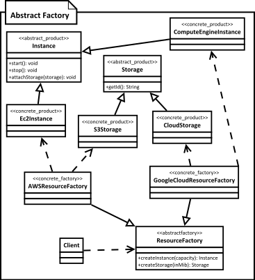

[<back](README.md)

# Design Patterns
* **Creational**: Creational patterns deal with the process of creation of objects of classes. for example your requirement to create multiple objects or only single object of a class.
    * Builder
    * Simple Factory
    * Factory Method
    * Prototype
    * Singleton
    * Abstract Factory
    * Object Pool
* **Structural**: Structural patterns deal with how classes and objects are arranged or composed.
    * Adapter
    * Bridge
    * Decorator
    * Composite
    * Facade
    * Flyweight
    * Proxy
* **Behavioral**: Behavioral patterns describes how classes and objects interact & communicate with each other.


## ***Builder Design Pattern***
We have 4 different roles in Builder shown in image.
1. Director
2. Builder
3. Concrete Builder
4. Product
<!--  -->


* We have a complex process to construct an object involving multiple steps, then builder design pattern can help us.
* In builder we remove the logic related to object construction from "client" code & abstract it in separate classes.

### Use Case
* Think of builder pattern when you have a complex constructor or an object is built in multiple steps.

### Implementation
* We start by creating a builder
    * Identify the `parts` of the object & provide methods to create those parts.
    * It should provide a method to `assemble` or build the object.
    * It must provide a way/method to get fully built object out. Optionally builder can keep reference to an product it has built so the same can be returned again in future.
* A director can be a separate class or client can play the role of director.

### Consideration
* You can easily create an immutable class by implementing builder as an inner static class. You'will find this type of implementation used quite frequently even if immutability is not a main concern.
* The director role is rarely implemented as separate class, typically the consumer of the object instance or the client handles that role.
* Abstract builder is also not required if "product" itself is not part of any inheritance hierarchy. You can directly create concrete builder.
* If you are running into a "too many constructor arguments" problem then it is a good indication that builder pattern may help.

### Pitfalls
* A little biit complex mainly because of builder method chaining where builder object's methods return object itself.

## ***Simple Factory Design Pattern***


* Here we simply move the instantiation logic to a separate class and most commonly to a static method of this class.
* Some do not consider simple factory to be a `design pattern`, as its simply a method that encapsulates object instantiation. Nothing complex goes on in that method.
* Typically we want to do this if we have more then one option when instantiating object and a simple logic is used to choose correct class.

**Implement Consideration**
* Simple factory can be just a method in existing class. Adding a separate class however allows other parts of your code to use simple factory more easily.
* Simple factory itself doesn't need any state tracking so it is best to keep this as a static method.

**Design Consideration**
* Simple factory will in turn may use other design pattern like builder to construct objects.
* In case you want to specialize your simple factory in sub classes, you need factory method design pattern instead.

### Implementation
* We start by creating a separate class for our simple factory
    * Add a method which returns desired object instance.
        * This method is typically static and will accept some argument to decide which class to instantiate
        * You can also provide additional arguments which will be used to instantiate objects

### Differences between Simple Factory & Factory Method
* Simple Factory:
    * We simply move our instantiation logic away from client code. Typically in a static method.
    * Simple factory know about all classes whose objects it can create.
* Factory Method:
    * Factory Method is more useful when you want to delegate object creation to subclasses.
    * In Factory method we don't know in advance about all product subclasses.

### Pitfalls
* The criteria used by simple factory to decide which object to instantiate can get more convoluted/complex over time. If you find yourself in such situation then use factory method.

## ***Factory Method***
* Use Factory method when you want to delegate object instantiation to subclasses, you'd want to do this when you have `product` inheritance hierarchy and possibility of future additions to that.


* We want to move the object creation logic from our code to a separate class.
* We use this pattern when we do not know in advance which class we may need to instantiate beforehand & also to allow new classes to be added to system and handle their creation without affecting client code.
* We let subclasses decide which object to instantiate by overriding the factory method.

**Implementation Consideration**
* The creator can be concrete class & provide a default implementation for the factory method. In such cases you'll create some default object in base creator.
* You can also use the simple factory way of accepting additional arguments to choose between different object types. Subclasses can then override factory method to selectively create different objects for some criteria.

**Design Consideration** 
* Creator hierarchy in factory method pattern reflects the product hierarchy. We typically end up with a concrete creator per object type.
* Template method design pattern often makes use of factory methods.
* Another creational design pattern called `abstract factory` makes use of factory method pattern.

### Pitfalls
* More complex to implement. More classes involved and need unit testing.
* You hvae to start with Factory Method design pattern from the begining. It's not easy to refactor existing code into factory method pattern.
* Sometimes this pattern forces you to subclass just to create appropriate instance.

## ***Prototype***
* Think of prototype pattern when you have an object where construction of an new instance is costly or not possible (object is supplied to your code).
* In Java we typically implement this pattern with clone method.
* Objects which have a majority of their state as immutable are good candidates for prototype.
* When implementing clone method pay attention to the requirement of deep or shallow copy of object state.
* Also we have to insure that clone is `initialized`; that is appropriate states are reset before returning the copy to outside world.
* We have a complex object that is costly to create. To create more instances of suct class, we use an existing instance as our prototype.


### Implementation
* We start by creating a class which will be a prototype
    * The class must implement Cloneable interface(Java Inbuild Marker Interface)
    * Class should override clone method and return copy of itself.
    * The method should declare CloneNotSupportedException in throws clause to give subclasses chances to decide on whether to support cloning.
* Clone method implementation should consider the deep & shallow copy and choose whichever is applicable.

**Implemetation Considerations**
* Pay attention to the deep copy and shallow copy of references. Immutable fields on clones save the trouble of deep copy.
* Make sure to reset the mutable state of object before returning the prototype. It is good idea to implement this in method to allow subclasses to initialize themselves.
* clone() method is protected in Object class and must be overridden to be public to be callable from outside the class.
* Cloneable is a `marker` interface, and indication that the class supports cloning.

**Design Considerations**
* Prototype are useful when you have large objects where majority of state is unchanged between instances and you can easily identify that state.
* A prototype registry is a class where in you can register various prototypes which other code can access to clone out instances. This solves the issue of getting access to initial instance.

### Differnce between Prototype and Singleton
* Prototype return a copy of an instance, meaning we get a different instance, but Singleton return same instance every time.

### Pitfalls
* Usability depends upon the number of properties in state that are immutable or can be shallow copied. An object where state is comprised of large number of mutable objects is complicated to clone.
* In java the default clone operation will only perform the shallow copy so if you need a deep copy you've to implement it.
* Subclasses may not be able to support clone and so the code becomes complicated as you have to code for situations where an implementation may not support clone.

## ***Abstract Factory***
* Whenever you have multiple sets of objects where objects in one set work together then you can use abstract factory pattern to isolate client code form concrete objects & their factories.
* Abstract factory itself uses factory method pattern and you can think of them as objects with multiple factory methods.
* Adding a new product type needs changes to base factory and all its implementations.
* Concrete factories can be singleton as we need only one instance of them in code.
* We provide client code with concrete factory instance. Factories can be changed at runtime.



* Abstract factory is used when we have two or more objects which work together forming a kit or set and there can be multiple sets or kits that can be created by client code.
* So we separate client code from concrete objects forming such a set and also from the code which creates these sets.

### Implementation
* We start by studying the product `sets`
    * Create abstract factory as an abstract class or an interface.
    * Abstract factory defines abstract methods for creating products.
    * Provide concrete implementation of factory for each set of products.
* Abstract factory makes use of factory method pattern. You can think of abstract factory as an object with multiple factory methods.

**Implementation Considerations**
* Factories can be implemented as singletons, we typically ever need only one instance of it anyway. But make sure to familiarize yourself with drawbacks of singletons.
* Adding a new product type requires changes to the base factory as well as all implementations of factory.
* We provide the client code with concrete factory so that it can create objects.

**Design Considerations**
* When you want to constrain objecct creations so that they all work together then abstract factory is good design pattern.
* Abstract factory uses factory method pattern.
* If objects are expensive to create then you can transparently switch factory implementations to use prototype design pattern to create objects.

### Pitfalls
* A lot more complex to implement than factory method.
* Adding a new product requires changes to base factory as well as All implementations of factory.
* Difficult to visualize the neeed at start of development as usually start out as a factory method.
* Abstract factory design pattern is very specific to the problem of `product families`

## ***Singleton***
* Singleton pattern is used when you want to ensure that only one instance of a class exists in application.
* In Java we achieve this by making constructor private, this also prevents inheritance & providing a public static method which returns the singleton instance.
* Implementaion wise we have two broad choices:
    1. Eagar Loading Singleton, we create instance as soon as class is loaded by classloader.
    2. Lazy Loading Singleton, we defer creation until some code actually requests the instance.
* Always prefer the eager loading instance unless creation cost is high and start-up time impact is noticeable.

**Good Choice**
* Application configuration values can be tracked in a singleton. Typically these are read from file at start and then referred to by other parts of application.
* Logging frameworks also make use of Singleton pattern.
* Sprint framework treats all beans by default as singletons. In spring we don't have to make any changes to ensure single instance, Spring handles that for us.


### Difference between Singleton and Factory Method
* Primary purpose or intent of singeton pattern is to ensure that only one instance of a class is ever created. Factory method is primarily used to isolate client code from object creation & delegate object creation to subclasses.
* Singleton instance is created without any need of arguments from client code. Factory method allows to parameterize the object creation.

### Pitfalls
* Singleton pattern can deceive you about true dependencies! Since they are globally accessible its easy to miss dependencies.
* They are hard to unit test. You cannot easily mock the instance that is returned.
* Most common way to implement Singletons in Java is through static variables and they held per class loader and not per JVM. So they may not be truly Singleton in an OSGi or web application.
* A Singleton carrying around a large `mutable` global state is a good indication of an abused Singleton pattern.

## ***Object Pool***
- In our system if `cost of creating an instance` of a class is high and we need `a large number of objects` of this class `for short duration`, then we can use an object pool.
- We eighter pre-create objects of the class or collect unused instances in an in memory cache. When code needs an object of this class we provide it form this cache.
- Typically objects that represent fixed external system resources like threads, connections or other system resources are good candidates for pooling.
- Objects to be pooled should provide a method to `reset` their state so they can be reused. This operation should be efficient as well, otherwise release operation will be costly.
- Pool must handle synchronization issues efficiently and reset object state before adding them to pool for reuse.
- Client code must release pooled objects back into the pool so they can be reused. Failing to do so will break the system. Thread pools can work around this since the a thread can know when its work is done.
- Difficult to optimize as pools are sensitive to system load at runtime (demand of pooled objects).
- Pools are good choice when the pooled objects represent a fixed quantity of externally available resource like thread or a connection.
- One of the most complicated patterns to implement efficiently & without defects.
- If you create objects when pool is empty then we have to make sure that pool size is maintained or else we can end up with large.


**Implementation**
- We start by creating class for object pool
    - A thread-safe caching of objects should be done in pool.
    - Methods to acquire and release objects should be provided & pool should reset cached objects before giving them out.
- The reusable object must provide methods to reset its state upon `release` by code.
- We have to decide whether to create new pooled objects when pool is empty or to wait until an object becomes available. Choice is influenced by whether the object is tied to a fixed number of external resources. 

**Implementation Consideration**
- Resetting object state should NOT be costly operation otherwise you may end up losing your performance savings.
- Pre-caching objects; meaning creating objects in advance can be helpful as it won't slow down the code using these objects. However it may add-up to start up time & memory consumption.
- Object pool's synchronization shoul consider the reset time needed & avoid resetting in synchronized context if possible.

**Design Considerations**
- Object pool can be parameterized to cache & return multiple objects and the acquire method can provide selection criteria.
- Pooling objects is only beneficial if they involve costly initialization because of initialization of external resource like a connection or a thread. Don't pool objects ***JUST*** to save memory, unless you are running into out of memory errors.
- Do not pool long lived objects or only to save frequent call to new. Pooling may actually negatively impact performance in such cases.

**Examples**
- Using object pool for saving the memory allocation & GC cost is almost deprected now. JVMs & hardware are more efficient & have access to more memory now.
- However it is still a very common pattern when we are interacting with external resources like threads, connections.
- java.util.concurrent.ThreadPoolExecutor is an example of object pool pattern which pools threads. Even through we can directly use this class, you'll often use it via ExecutorService interface using method like Executors like newCachedThreadPool().
```java
ExecutorService service = Executors.newCaschedThreadPool();
service.submit(()->System.out.println(Thread.currentThread().getName()));
service.submit(()->System.out.println(Thread.currentThread().getName()));
service.submit(()->System.out.println(Thread.currentThread().getName()));

service.shutdown();
```
- Apache commons dbcp libary libary is used for database connetion pooling. Class org.apache.commons.dpcp.BasicDataSource in dbcp package is an example of object pool pattern which pools database connections. This pool is commonly created and exposed via JNDI or as a Spring bean in applications.
```java
// Construct BasicDataSource
// typically is bound to JNDI or set as spring bean
BasicDataSource dataSource = new BasicDataSource();
dataSource.setDriverClassName("com.mysql.jdbc.Driver");
dataSource.setUrl("jdbc:mysql://localhost/db_name");
dataSource.setUsername("user_name");
dataSoruce.setPassword("user_pass");

//Then runtime
Connection conn = dataSource.getConnection();
// Use connection, and then close it to return it to pool.
conn.close();

// At application shutdown, close the pool
dataSource.close();
```

### Difference between Object Pool & Prototype
- In Object Pool, we have cached objects that frequently live throughout programs entire run. Prototype creates object when needed and no caching is done.
- In Object Pool, code using objects from object pool has to return the objects explicitly to pool. Depending on implementation, failing to return to pool may lead to memory and/or resource leak. On the other have Prototype, once and object is cloned no special treatment is needed by client code and object can be used like any regular object. 

### Pitfalls
- Successful implementation depends on correct use by the client code. Releasing objects back to pool can be vital for correct working.
- The reusable object needs to take care of resetting its state in efficient way. Some objects may not be suitable for pooling due to this requirement.
- Difficult to use in refactoring legacy code as the client code & reusable object both need to be aware of object pool.
- You have to decide what happens when pool is empty is empty and there is a demand for an object. You can either wait for an object to become free or create a new object. Both options have issues. Waiting can have severe negative impact on performance.
- If you create new objects when code asks for an object and none are available then you have to do additional work to maintain or trim the pool size or else you'll end up with very large pool.

## ***Adapter Design Pattern***
* We ahve an existing object which provides the functionality that client needs. But client code can't use this object because it expects an object with different interface.
* Using adapter design pattern we make this existing object work with client by adapting the object to client's expected interface.
* This pattern is also called as wrapper as it `wraps` existing object.


**Prefered Way**


### **Implementation Steps**
* We start by creating a class for Adapter
    * Adapter must implement the interface expected by client.
    * First we are going to try out a class adapter by also extending from our existing class.
    * In the class adapter implementation we're simply going to forward the method to another method inherited from adaptee.
    * Next for object adapter, we are only going to implement target interface and accept adaptee as construtor argument in adapter i.e. make use of composition.
