# Basic Programs

1. `Fibonacci Series:` Next number is the sum of previous two numbers
2. `Prime Number Program:` Prime number is a number that is greater than 1 and divided by 1 or itself only.
3. `Palindrome Program:` A number that is same after reverse.
4. `Factorial Program:` Factorial of n is the product of all positive descending integers.
5. `Armstrong Number (or pluperfect, or Plus Perfect, or Narcissistic):` A positive m-digit number that is equal to the sum of the mth powers of their digits.

	Number | Digits | Algorithm | Result
	-----		| --- | --------- | ----
	371 | Three digits | 3^3 + 7^3 + 1^3 = 27 + 343 + 1 = 371 | Armstrong number.

	* All single digit numbers are Armstrong numbers. 
	* No 2-digit numbers are Armstrong numbers. 
	* Four 3-digit numbers are Armstrong numbers. 
	* Two 4-digit numbers are Armstrong numbers.  
6. `Generate Random Number:` A random number occurs in a specified distribution only when two conditions are met: 
	1. The values are uniformly distributed over a defined interval or set, and 
	2. It is impossible to predict future values based on past or present ones.
	
	* `Generate by Method:` Generate a Random Number using Method: 
	```java 
		Math.random() * (max - min + 1) + min
	```
	* `Generate by Class:` Class java.util.Random
	```java
		import java.util.Random;

		Random random = new Random();
		// Generates random integers 0 to 49  
		int x = random.nextInt(50);
		double a = random.nextDouble();
		float f=random.nextFloat();
		long p = random.nextLong();
		boolean m=random.nextBoolean();
	```
	* `Generate by ThreadLocalRandom Class:` java.util.concurrent.ThreadLocalRandom
	```java
		import java.util.concurrent.ThreadLocalRandom;

		// Generate random integers between 0 to 999 
		int a = ThreadLocalRandom.current().nextInt();
		// Generate Random double values
		double c = ThreadLocalRandom.current().nextDouble();
		// Generate random boolean values
		boolean e = ThreadLocalRandom.current().nextBoolean();
	```
7. `Print Pattern:` There are three categories:
	* `Star Pattern:`
		1. Right Triangle Star Pattern   
		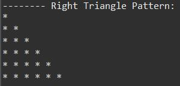
		2. Left Triangle Star Pattern   
		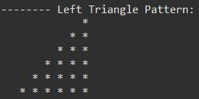
		3. Pyramid Star Pattern   
		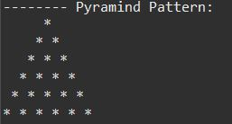
		4. Diamond Shape Pattern   
		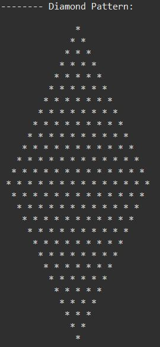
		5. Downward Triangle Star Pattern   
		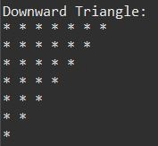
		6. Mirrored Right Triangle Star Pattern   
		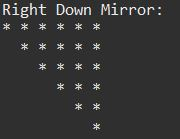
		7. Reverse Pyramid Star Pattern   
		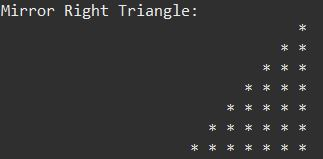
		8. Right Down Mirror Star Pattern   
		
		9. Right Pascal's Triangle   
		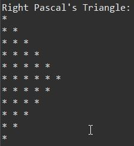
		10. Left Pascal's Triangle   
		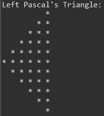
		11. Sandglass Star Pattern   
		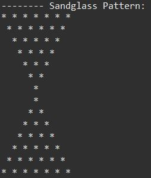
		12. Alphabet Star Pattern   
		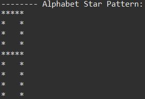
		13. Triangle Star Pattern   
		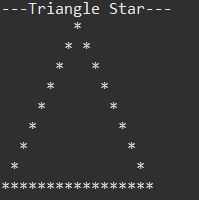
		14. Down Triangle Pattern   
		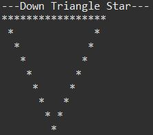
		15. Diamond Star Pattern   
		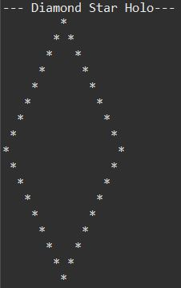
	* `Number Pattern:` 
		1. Pattern-1
		2. Pattern-2
	* `Number Pattern:` 
8. `Compare Two Objects:` 
9. `Create Object:` 
10. `Print ASCII Value:` 

# Number Program
1) `Reverse a Number:`
2) `convert Number to Word:`
3) `Automorphic Number:`
4) `Peterson Number:`
5) `Sunny Number:`
6) `Tech Number:`
7) `Fascinating Number:`
8) `Keith Number:`
9) `Neon Number:`
10) `Spy Number:`
11) `ATM program:`
12) `Autobiographical Number:`
13) `Emirp Number:`
14) `Sphenic Number:`
15) `Buzz Number:`
16) `Duck Number:`
17) `Evil Number:`
18) `ISBN Number:`
19) `Krishnamurthy Number:`
20) `Bouncy Number:`
21) `Mystery Number:`
22) `Smith Number:`
23) `Strontio Number:`
24) `Xylem and Phloem Number:`
25) `nth Prime Number:`
26) `Display Alternate Prime Numbers:`
27) `Find Square Root of a Number Without sqrt Method:`
28) `Swap Two Numbers Using Bitwise Operator:`
29) `Find GCD of Two Numbers:`
30) `Find Largest of Three Numbers:`
31) `Find Smallest of Three Numbers Using Ternary Operator:`
32) `Check if a Number is Positive or Negative:`
33) `Check if a Given Number is Perfect Square:`
34) `Display Even Numbers From 1 to 100:`
35) `Display Odd Numbers From 1 to 100:`
36) `Find Sum of Natural Numbers:`
