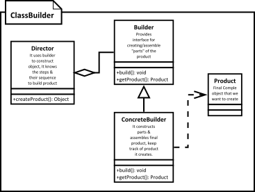

[<back](../DesignPattern.md)

# Builder Design Pattern
We have 4 different roles in Builder shown in image.
1. Director
2. Builder
3. Concrete Builder
4. Product

* We have a complex process to construct an object involving multiple steps, then builder design pattern can help us.
* In builder we remove the logic related to object construction from "client" code & abstract it in separate classes.

## Use Case
* Think of builder pattern when you have a complex constructor or an object is built in multiple steps.

## Implementation
* We start by creating a builder
    * Identify the `parts` of the object & provide methods to create those parts.
    * It should provide a method to `assemble` or build the object.
    * It must provide a way/method to get fully built object out. Optionally builder can keep reference to an product it has built so the same can be returned again in future.
* A director can be a separate class or client can play the role of director.

## Consideration
* You can easily create an immutable class by implementing builder as an inner static class. You'will find this type of implementation used quite frequently even if immutability is not a main concern.
* The director role is rarely implemented as separate class, typically the consumer of the object instance or the client handles that role.
* Abstract builder is also not required if "product" itself is not part of any inheritance hierarchy. You can directly create concrete builder.
* If you are running into a "too many constructor arguments" problem then it is a good indication that builder pattern may help.

## Pitfalls
* A little biit complex mainly because of builder method chaining where builder object's methods return object itself.