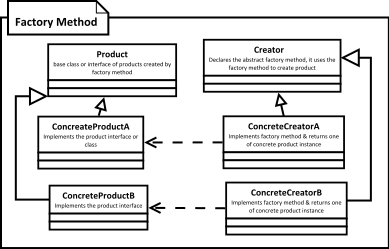

[<back](../DesignPattern.md)

# Factory Method
* Use Factory method when you want to delegate object instantiation to subclasses, you'd want to do this when you have `product` inheritance hierarchy and possibility of future additions to that.

* We want to move the object creation logic from our code to a separate class.
* We use this pattern when we do not know in advance which class we may need to instantiate beforehand & also to allow new classes to be added to system and handle their creation without affecting client code.
* We let subclasses decide which object to instantiate by overriding the factory method.

**Implementation Consideration**
* The creator can be concrete class & provide a default implementation for the factory method. In such cases you'll create some default object in base creator.
* You can also use the simple factory way of accepting additional arguments to choose between different object types. Subclasses can then override factory method to selectively create different objects for some criteria.

**Design Consideration** 
* Creator hierarchy in factory method pattern reflects the product hierarchy. We typically end up with a concrete creator per object type.
* Template method design pattern often makes use of factory methods.
* Another creational design pattern called `abstract factory` makes use of factory method pattern.

### Pitfalls
* More complex to implement. More classes involved and need unit testing.
* You hvae to start with Factory Method design pattern from the begining. It's not easy to refactor existing code into factory method pattern.
* Sometimes this pattern forces you to subclass just to create appropriate instance.

