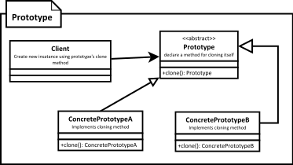

[<back](../DesignPattern.md)

# Prototype
* Think of prototype pattern when you have an object where construction of an new instance is costly or not possible (object is supplied to your code).
* In Java we typically implement this pattern with clone method.
* Objects which have a majority of their state as immutable are good candidates for prototype.
* When implementing clone method pay attention to the requirement of deep or shallow copy of object state.
* Also we have to insure that clone is `initialized`; that is appropriate states are reset before returning the copy to outside world.
* We have a complex object that is costly to create. To create more instances of suct class, we use an existing instance as our prototype.

### Implementation
* We start by creating a class which will be a prototype
    * The class must implement Cloneable interface(Java Inbuild Marker Interface)
    * Class should override clone method and return copy of itself.
    * The method should declare CloneNotSupportedException in throws clause to give subclasses chances to decide on whether to support cloning.
* Clone method implementation should consider the deep & shallow copy and choose whichever is applicable.

**Implemetation Considerations**
* Pay attention to the deep copy and shallow copy of references. Immutable fields on clones save the trouble of deep copy.
* Make sure to reset the mutable state of object before returning the prototype. It is good idea to implement this in method to allow subclasses to initialize themselves.
* clone() method is protected in Object class and must be overridden to be public to be callable from outside the class.
* Cloneable is a `marker` interface, and indication that the class supports cloning.

**Design Considerations**
* Prototype are useful when you have large objects where majority of state is unchanged between instances and you can easily identify that state.
* A prototype registry is a class where in you can register various prototypes which other code can access to clone out instances. This solves the issue of getting access to initial instance.

### Differnce between Prototype and Singleton
* Prototype return a copy of an instance, meaning we get a different instance, but Singleton return same instance every time.

### Pitfalls
* Usability depends upon the number of properties in state that are immutable or can be shallow copied. An object where state is comprised of large number of mutable objects is complicated to clone.
* In java the default clone operation will only perform the shallow copy so if you need a deep copy you've to implement it.
* Subclasses may not be able to support clone and so the code becomes complicated as you have to code for situations where an implementation may not support clone.