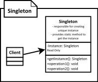

[<back](../DesignPattern.md)

# Singleton
* Singleton pattern is used when you want to ensure that only one instance of a class exists in application.
* In Java we achieve this by making constructor private, this also prevents inheritance & providing a public static method which returns the singleton instance.
* Implementaion wise we have two broad choices:
    1. Eagar Loading Singleton, we create instance as soon as class is loaded by classloader.
    2. Lazy Loading Singleton, we defer creation until some code actually requests the instance.
* Always prefer the eager loading instance unless creation cost is high and start-up time impact is noticeable.

**Good Choice**
* Application configuration values can be tracked in a singleton. Typically these are read from file at start and then referred to by other parts of application.
* Logging frameworks also make use of Singleton pattern.
* Sprint framework treats all beans by default as singletons. In spring we don't have to make any changes to ensure single instance, Spring handles that for us.

### Difference between Singleton and Factory Method
* Primary purpose or intent of singeton pattern is to ensure that only one instance of a class is ever created. Factory method is primarily used to isolate client code from object creation & delegate object creation to subclasses.
* Singleton instance is created without any need of arguments from client code. Factory method allows to parameterize the object creation.

### Pitfalls
* Singleton pattern can deceive you about true dependencies! Since they are globally accessible its easy to miss dependencies.
* They are hard to unit test. You cannot easily mock the instance that is returned.
* Most common way to implement Singletons in Java is through static variables and they held per class loader and not per JVM. So they may not be truly Singleton in an OSGi or web application.
* A Singleton carrying around a large `mutable` global state is a good indication of an abused Singleton pattern.