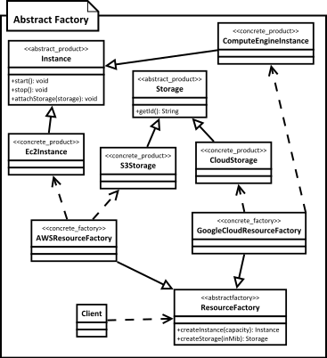

[<back](../DesignPattern.md)

## ***Abstract Factory***
* Whenever you have multiple sets of objects where objects in one set work together then you can use abstract factory pattern to isolate client code form concrete objects & their factories.
* Abstract factory itself uses factory method pattern and you can think of them as objects with multiple factory methods.
* Adding a new product type needs changes to base factory and all its implementations.
* Concrete factories can be singleton as we need only one instance of them in code.
* We provide client code with concrete factory instance. Factories can be changed at runtime.

* Abstract factory is used when we have two or more objects which work together forming a kit or set and there can be multiple sets or kits that can be created by client code.
* So we separate client code from concrete objects forming such a set and also from the code which creates these sets.

### Implementation
* We start by studying the product `sets`
    * Create abstract factory as an abstract class or an interface.
    * Abstract factory defines abstract methods for creating products.
    * Provide concrete implementation of factory for each set of products.
* Abstract factory makes use of factory method pattern. You can think of abstract factory as an object with multiple factory methods.

**Implementation Considerations**
* Factories can be implemented as singletons, we typically ever need only one instance of it anyway. But make sure to familiarize yourself with drawbacks of singletons.
* Adding a new product type requires changes to the base factory as well as all implementations of factory.
* We provide the client code with concrete factory so that it can create objects.

**Design Considerations**
* When you want to constrain objecct creations so that they all work together then abstract factory is good design pattern.
* Abstract factory uses factory method pattern.
* If objects are expensive to create then you can transparently switch factory implementations to use prototype design pattern to create objects.

### Pitfalls
* A lot more complex to implement than factory method.
* Adding a new product requires changes to base factory as well as All implementations of factory.
* Difficult to visualize the neeed at start of development as usually start out as a factory method.
* Abstract factory design pattern is very specific to the problem of `product families`

