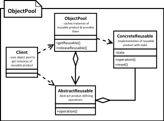

[<back](../DesignPattern.md)

# Object Pool
- In our system if `cost of creating an instance` of a class is high and we need `a large number of objects` of this class `for short duration`, then we can use an object pool.
- We eighter pre-create objects of the class or collect unused instances in an in memory cache. When code needs an object of this class we provide it form this cache.
- Typically objects that represent fixed external system resources like threads, connections or other system resources are good candidates for pooling.
- Objects to be pooled should provide a method to `reset` their state so they can be reused. This operation should be efficient as well, otherwise release operation will be costly.
- Pool must handle synchronization issues efficiently and reset object state before adding them to pool for reuse.
- Client code must release pooled objects back into the pool so they can be reused. Failing to do so will break the system. Thread pools can work around this since the a thread can know when its work is done.
- Difficult to optimize as pools are sensitive to system load at runtime (demand of pooled objects).
- Pools are good choice when the pooled objects represent a fixed quantity of externally available resource like thread or a connection.
- One of the most complicated patterns to implement efficiently & without defects.
- If you create objects when pool is empty then we have to make sure that pool size is maintained or else we can end up with large.



**Implementation**
- We start by creating class for object pool
    - A thread-safe caching of objects should be done in pool.
    - Methods to acquire and release objects should be provided & pool should reset cached objects before giving them out.
- The reusable object must provide methods to reset its state upon `release` by code.
- We have to decide whether to create new pooled objects when pool is empty or to wait until an object becomes available. Choice is influenced by whether the object is tied to a fixed number of external resources. 

**Implementation Consideration**
- Resetting object state should NOT be costly operation otherwise you may end up losing your performance savings.
- Pre-caching objects; meaning creating objects in advance can be helpful as it won't slow down the code using these objects. However it may add-up to start up time & memory consumption.
- Object pool's synchronization shoul consider the reset time needed & avoid resetting in synchronized context if possible.

**Design Considerations**
- Object pool can be parameterized to cache & return multiple objects and the acquire method can provide selection criteria.
- Pooling objects is only beneficial if they involve costly initialization because of initialization of external resource like a connection or a thread. Don't pool objects ***JUST*** to save memory, unless you are running into out of memory errors.
- Do not pool long lived objects or only to save frequent call to new. Pooling may actually negatively impact performance in such cases.

**Examples**
- Using object pool for saving the memory allocation & GC cost is almost deprected now. JVMs & hardware are more efficient & have access to more memory now.
- However it is still a very common pattern when we are interacting with external resources like threads, connections.
- java.util.concurrent.ThreadPoolExecutor is an example of object pool pattern which pools threads. Even through we can directly use this class, you'll often use it via ExecutorService interface using method like Executors like newCachedThreadPool().
```java
ExecutorService service = Executors.newCaschedThreadPool();
service.submit(()->System.out.println(Thread.currentThread().getName()));
service.submit(()->System.out.println(Thread.currentThread().getName()));
service.submit(()->System.out.println(Thread.currentThread().getName()));

service.shutdown();
```
- Apache commons dbcp libary libary is used for database connetion pooling. Class org.apache.commons.dpcp.BasicDataSource in dbcp package is an example of object pool pattern which pools database connections. This pool is commonly created and exposed via JNDI or as a Spring bean in applications.
```java
// Construct BasicDataSource
// typically is bound to JNDI or set as spring bean
BasicDataSource dataSource = new BasicDataSource();
dataSource.setDriverClassName("com.mysql.jdbc.Driver");
dataSource.setUrl("jdbc:mysql://localhost/db_name");
dataSource.setUsername("user_name");
dataSoruce.setPassword("user_pass");

//Then runtime
Connection conn = dataSource.getConnection();
// Use connection, and then close it to return it to pool.
conn.close();

// At application shutdown, close the pool
dataSource.close();
```

### Difference between Object Pool & Prototype
- In Object Pool, we have cached objects that frequently live throughout programs entire run. Prototype creates object when needed and no caching is done.
- In Object Pool, code using objects from object pool has to return the objects explicitly to pool. Depending on implementation, failing to return to pool may lead to memory and/or resource leak. On the other have Prototype, once and object is cloned no special treatment is needed by client code and object can be used like any regular object. 

### Pitfalls
- Successful implementation depends on correct use by the client code. Releasing objects back to pool can be vital for correct working.
- The reusable object needs to take care of resetting its state in efficient way. Some objects may not be suitable for pooling due to this requirement.
- Difficult to use in refactoring legacy code as the client code & reusable object both need to be aware of object pool.
- You have to decide what happens when pool is empty is empty and there is a demand for an object. You can either wait for an object to become free or create a new object. Both options have issues. Waiting can have severe negative impact on performance.
- If you create new objects when code asks for an object and none are available then you have to do additional work to maintain or trim the pool size or else you'll end up with very large pool.