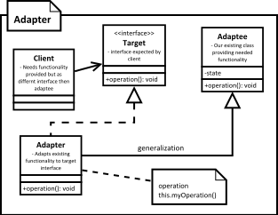

[<back](../DesignPattern.md)

# Adapter Design Pattern
- We have an existing object with requierd functionality but the client code is expecting a different interface than our object.
- A class adapter is one where adapter inherits from class of object which is to be adapted and implements the interface required by client code. This adapter type should be avoided.
- An object adapter uses composition. It will implement the target interface and use an adaptee object composition to perform translation. This allows us to use subclasses of adaptee in adapter.
* We have an existing object which provides the functionality that client needs. But client code can't use this object because it expects an object with different interface.
* Using adapter design pattern we make this existing object work with client by adapting the object to client's expected interface.
* This pattern is also called as wrapper as it `wraps` existing object.

**Prefered Way**

### **Implementation Steps**
* We start by creating a class for Adapter
    * Adapter must implement the interface expected by client.
    * First we are going to try out a class adapter by also extending from our existing class.
    * In the class adapter implementation we're simply going to forward the method to another method inherited from adaptee.
    * Next for object adapter, we are only going to implement target interface and accept adaptee as construtor argument in adapter i.e. make use of composition.
* An object adapter should take adaptee as an argument in constructor or as a less preferred solution, you can instantiate it in the constructor thus tightly coupling with a specific adaptee.

**Implementation Considerations**
- How much the adapter does depends upon the differences between target interface and object being adapted. If method arguments are same or similar adapter has very less work to do.
- Using class adapter `allows` you to override some of the adaptee's behaviour. But this has to be avoided as you end up with adapter that behaves differently than adaptee. Fixing defects is not easy anymore!
- Using object adapter allows you to potentially change the adaptee object to one of its subclasses.

**Design Considerations**
- In java a `class adapter` may not be possible if both target and adaptee are concrete classes. In such cases the object adapter is the only solution. Also since there is no private inheritance in Java, it's better to stick with object adapter.
- A class adapter is also called as a two way adapter, since it can stand in for both the target interface an for the adaptee. That is we can use object of adapter where either target interface is expected as well where an adaptee object is expected.

**Examples**
- The java.io.InputStreamReader and java.io.OutputStreamWriter classes are examples of object adapters.
- These classes adapt existing InputStream/OutputStream object to a Reader/Writer interface.

### Difference between Adapter & Decorator
- Adapter purpose is simply adapts and object to another interface without changing behaviour. Decorator enhances object behaviour without changing its interface.
- In Adapter it is not easy to use recursive composition, that is an adapter adapting another adapter since adapters change interface. Since decorators do not change the interface, we can do recursive composition or in other words decorate a decorator with ease. Since a decorator is indistinguishable from main object.

### Pitfalls
- Using target interface and adaptee class to extend our adapter we can create a `class adapter` in java. However it creates an object which exposes unrelated methods in parts of your code, polluting it. Avoid class adapters! It is mentioned here only for sake of completeness.
- It is tempting to do a lot of things in adapter besides simple interface translation. But this can result in an adapter showing different behaviour than the adapted object.
- Not a lot of other pitfalls! As long as we keep them true to their purpose of simple interface translation they are good.