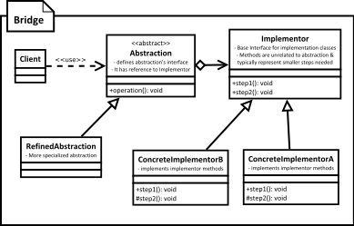

[<back](../DesignPattern.md)

# Bridge Design Pattern
- We use bridge pattern when we want our abstractions and implementations to be decoupled.
- Bridge pattern defines separate inheritance hierarchies for abstraction & implementations and bridge these two together using composition.
- Implementations do not have to define methods that match up with methods in abstraction. It is fairly common to have primitive methods; methods which do small work; in implementor. Abstraction uses these methods to provide its functionality.

- Our implementation & abstractions are generally coupled to each other in normal inheritance.
- Using bridge pattern we can decouple them so they can both change without affecting each other.
- We achieve this feat by creating two separate inheritance hierarchies; one for implementation and another for abstraction.
- We use composition to bridge these two hierarchies.

**Implement a Bridge**
- We start by defining our abstraction as needed by client
	- We determine common base operations and define them in abstraction.
	- We can optionally also define a refined abstraction & provide more specialized operations.
	- Then we define our implementor next. Implementor methods do NOT have to match with abstractor. However abstraction can carry out its work by using implementor methods.
	- Then we write one or more concrete implementor providing implemention.
- Abstractions are create by composing them with an instance of concrete implementor which is used by methods in abstraction.

**Implementation Considerations**
- In case we are going to have a single implementation then we can skip creating abstract implementor.
- Abstraction can decide on its own which concrete implementor to use in its constructor or we can delegate that decision to a third class. In last approach abstraction remains unaware of concrete implementors & provides greater de-coupling.

**Design Considerations**
- Bridge provides great extensibility by allowing us to change abstraction and implementor independently. You can build & package them separately to modularize overall system.
- By using abstract factory pattern to create abstraction objects with correct implementation you can de-couple concrete implementors from abstraction.

### Example
- An example of bridge pattern often given is the JDBC API. More specifically the java.sql.DriverManager class with the java.sql.Driver interface form a bridge pattern.
- An example of bridge pattern often given is the Collections.newSetFromMap() method. This method returns a Set which is backed by given map object.

### Difference between Bridge & Adapter
- Bridge is intent to allow abstraction and implementation to vary independently. Adapter is meant to make unrelated classes work together.
- Bridge has to be designed up front then only we can have varying abstractions & implementations. Adapter finds its usage typically where a legacy system is to be integrated with new code.

### Pitfalls
- It is fairly complex to understand & implement bridge design pattern.
- You need to have a well thought out & fairly comprehensive design in front of you before you can decide on bridge pattern.
- Needs to be designed up front. Adding bridge to legacy code is difficult. Even for ongoing project adding bridge at later time in development may require fair amount of rework.

