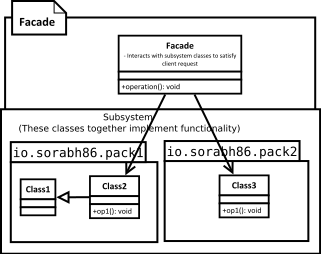

[<back](../DesignPattern.md)

# Facade
- Main purpose is to make your subsystem interaction loosely coupled but also simplify usage of system.
- We use facade when using our subsytem requires dealing with lots of classes & interfaces for client. Using facade we provide a simple interface which provides same functionality.
- Facade is not a simple method forwarding but facade methods encapsulate the subsystem class interactions which otherwise would have been done by client code.
- Facades are often added over existing legacy codes to simplify code usage & reduce coupling of client code to legacy code.

- Client has to interact with a large number of interfaces and classes in a subsystem to get result. So client gets tightly coupled with those interfaces & classes. Facade solves this problem.
- Facade provides a simple and unified interface to a subsystem. Client interacts with just the facade now to get same result.
- Facade is not just a one to one method forwarding to other classes.

## Implement a Facade
- We start by creating a class that will serve as a facade
	- We determine the overall `use-scase/tasks` that the subsystem is used for
	- We write a method that exposes each `use case` or task.
	- This method takes care of working with different classes of subsystem.
	
## Implementation Considerations
- A facade should minimize the complexity of subsystem and provide usable interface.
- You can have an interface or abstract class for facade and client can use different subclasses to talk to different subsystem implementations.
- A facade is not replacement for regular usage of classes in subsystem. Those can be still used outside of facade. Your subsystem class implementations should not make assumptions of usage of facade by client code.

## Design Consideration
- Facade is a great solution to simplify dependencies. It allows you to have a weak coupling between subsystems.
- If your only concern is coupling of client code to subsystem specific classes and not worried about simplification provided by a facade, then you can use abstract factory pattern in place of facade.

	
### Example of a Facade
- The java.net.URL class is a great example of facade. This class provides a simple method called as openStream() and we get an input stream to the resource pointed at by the URL object.
- This class takes care of dealing with multiple classes from the java.net package as well as some internal sun packages.
	
## Difference between Facade & Adapter
- The intent behind facade is to simplify the usage of subsystem for client code. Adapter is meant to simply adapt and object to different interface.
- Facade is not restricted by any existing interface. It often defines simple methods which handle complex interactions behind scenes. Adapter is always written to confirm to a particular interface expected by client code. It has to implement all the methods from interface and adapt them using existing object.

## Pitfalls
- Not a pitfall of the pattern itself but needing a facade in a new design should warrant another look at API design.
- It is often overused or misused pattern & can hide improperly designed API. A common misuse is to use them as `containers of related methods`. So be on the lookout for such cases during code reviews.