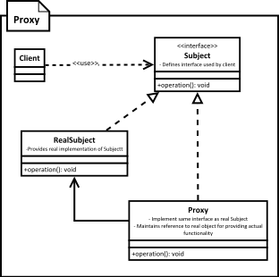

[<back](../DesignPattern.md)

# Proxy
- We want a stand in or placeholder object or we want control access to our objects method, then we can use proxy pattern.
- Proxy implements same interface as expected of real object. It delegates actual functionality to real object. Proxies are either given real object or they create one when needed. Some proxies talk to remote service behind the scene.
- In java we can also use dynamic proxies. These are created on the fly at runtime.

- We need to provide a placeholder or surrogate to another object.
- Proxy acts on behalf of the object and is used for lots of reasons some of the main reasons are:
	- **Protection Proxy** - Control access to original object's operations
	- **Remote Proxy** - Provides a local representation of a remote object
	- **Virtual Proxy** - Delays construction of original object until absolutely necessary (standing object, placeholder object)
- Client is unaware of existence of proxy. Proxy performs its work transparently.
	
## Implement a Proxy
- We start by implementing proxy
	- Proxy must implement same interface as the real subject.
	- We can either create actual object later when required or ask for one in constructor.
	- In method implementations of proxy we implement proxy's functionality before delegating to real object.
- How to provide client with proxies instance is decided by application. We can provide a factory or compose client code with proxies instance.
- what we are implementing above is also called as static proxy. Java also provides `dynamic proxies`
 
## Implement a Dynamic Proxy
- We start by implementing java.lang.reflect.InvocationHandler
	- Invocation handler implements invoke method which is called to handle every method invocation on proxy.
	- We need to take action as per the method invoked. We'll cache the Method instances on image interface so that we can compare them inside invoke method.
	- Our invocation handler will accept same argument in constructor as needed by constructor of real object.

## Implementation Considerations
- How proxy gets hold of the real object depends on what purpose proxy serves. For creation on demand type of proxies; actual object is created only when proxy can't handle client request. Authentication proxies use pre-built objects so they are provided with object during construction of proxy.
- Proxy itself can maintain/cache some state on behalf of real object in creation on demand use cases.
- Pay attention to performance cost of proxies as well synchronization issues added by proxy itself.

## Design Considerations
- Proxies typically do not need to know about the actual concrete implementation of real object.
- With Java you can use dynamic proxy allowing you to create proxies for any object at runtime.
- Proxies are great for implementing security or as stand-ins for real objects which may be a costly object that you want to defer loading. Proxies also make working with remote services/APIs easy by representing them as regular objects and possibly handling network communication behind the scene.

## Examples
- This is one pattern where you'll find numerous examples
- Hibernate uses a proxy to load collections of value types. If you have a relationship in entity class mapped as a collection, marked as candidate for lazy loading then Hibernate will provide a virtual proxy in its place.
- Spring uses proxy pattern to provide support for features like transactions, caching and general AOP support.
- Hibernate & Spring both can create proxies for classes which do not implement any interface. They use Third party framework like cglib, aspectJ to create dynamic proxies (Java's dynamic proxy needs interface) at runtime.

## Difference in Proxy & Decorator
- Depending on type of proxy it doesn't need real object all the time, A decorator need to have a real object for it to work.
- Purpose of proxy is to provide features like access control, lazy loading, auditing etc. A decorator is meant to add funtionality to existing functionality provided by object & used by client directly.

## Pitfalls
- Java's dynamic proxy only works if your class is implementing one or more interfaces. Proxy is created by implementing these interfaces.
- If you need proxies for handling multiple responsibilities like auditing, authentication, as a stand-in for the same instance, then it is better to have a single proxy to handle all these requirements. Due to the way some proxies create on their own, it becomes quite difficult to manage them.
- Static proxies look quite similar to other patterns like decorator & adapter patterns. It can be confusing to figure it out from code alone for someone not familiar with all these patterns.

