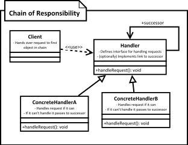

[<back](../DesignPattern.md)

# Chain of Responsibility
* When we want to decouple sender of request from the object which handles the request, we use chain of responsibility.
* We want this decoupling because we want to give multiple objects chance to handle the request & we don't know all objects before hand.
* A handler checks if it can handle the request. If it can't then it'll pass the request on to next handler in chain.
* You can pass the request down the chain even if a handler handles the request. Design pattern doesn't prevent that from happening.

- We need to avoid coupling the code which sends request to the code which handles that request.
- Typically the code which wants some request handled calls the exact method on and exact object to process it, thus the tight coupling. Chain of responsibility solves this problem by giving more then one object, chance to process the request.
- We create objects which are chained together by one object knowing reference of object which is next in chain. We give request to first object in chain, if it can't handle that it simply passes the request down the chain.

## Implement Chain of responsibility
- We start by defining handler interface/abstract class
	* Handler must define a method to accept incoming request
	* Handler can define method to access successor in chain. If it is an abstract class then we can even maintain successor
- Next we implement handler in one or more concrete handlers. Concrete handler should check if it can handle the request. If not then it should pass request to next handler.
- We have to create our chain of objects next. We can do it in client. Typically in real world this job will be done by some framework or initialization code written by you.
- Client needs to know only the first object in chain. It will pass on request to this object.

## Implementation Considerations
* Prefer defining handler as interface as it allows you to implement chain of responsibility without worrying about single inheritance rule of Java.
* Handlers can allow the request to propagate even if they handle the request. Servlet filter chains allow request to flow to next filter even if they perform some action on request.
* Chain can be described using XML or JSON as well so that you can add & remove handlers form chain without modifying code.

## Design Considerations
* Sometimes you can think of using existing connections or chains in objects. For examples if you are using composite pattern you already have a chain which can be used to implement this behavior.

## Example
* Probably the best example of chain of responsibility is servlet filters. Each filter gets a chance to handle incoming request and passes it down the chain once its work is done.
* All servlet filters implement the javax.servlet.Filter interface which defines following doFilter method doFilter.
* Implementations will use FilterChain object to pass request to next handler in chain. i.e. chain.doFilter(req, res);
* In servlet filters, it is common practice to allow other filters to handle request even if current filter takes some action on the request.

## Chain of Responsibility vs Command
* In chain of responsibility, if handler can't handle the request it will pass it on to next handler. With command there is no passing it on of request, command handles the request itself.
* Chain of responsibility has no guarantee that the request will be handled by at least one handler. With command pattern it is assured that command will be executed and request will be handled.
* Chain of responsibility don't track which handler handled the request and can't reverse the actions of handler. Commands are trackable. We can store command instances in same order as they execute and they are reversible in nature.

## Pitfalls
* There is no guarantee provided in the pattern that a request will be handled. Request can traverse whole chain and fall off at the other end without ever being processed and we won't know it.
* It is easy to misconfigure the chain when we are connecting successors. There is nothing in the pattern that will let us know of any such problems. Some handlers may be left unconnected to chain.

