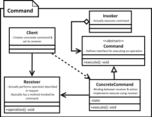

[<back](../DesignPattern.md)

# Command

* We want to represent a request or a method call as an object. Information about parameters passed and the actual operation is encapsulated in a object called command.
* Advantage of command pattern is that, what would have been a method call is now an object which can be stored for later execution or sent to other parts of code.
* We can now even queue our command objects and execute them later.

## Implement Command
* We start by writing command interface
	* It must define method which executes the command
* We next implement this interface in class for each request or operation type we want to implement. Command should also allow for undo operation if your system needs it.
* Each concrete command knows exactly which operation it needs. All it needs is parameters for the operation if required and the receiver instance on which operation is invoked.
* Client creates the command instance and sets up receiver and all required parameters.
* The command instance is then ready to be sent to other parts of code. Invoker is the code that actually uses command instance and invokes the execute on the command.

## Implementation Considerations
* You can support `undo` & `redo` in your commands. This makes them really useful for systems with complex user interactions like workflow designers.
* If your command is simple i.e. if it doesn't have undo feature, doesn't have any state & simply hides a particular function & its arguments then you can reuse same command object for same type of request.