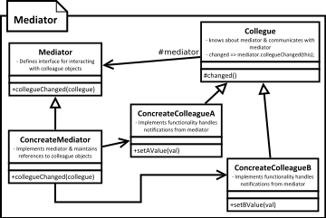

[<back](../DesignPattern.md)

# Mediator
* When we want to decouple a group of objects which communicate with each then we can use the mediator design pattern.
* Each object only knows about the mediator object and notifies it about change in it's state. Mediator in turn will notify other objects on its behalf.
* Mediators are typically specific to a collaboration. It's difficult to write a reusable mediator. Observer design pattern solves this problem. However mediators are easy to implement and extend.

* Mediator encapsulates how a set of objects interact with each other. Due to this encapsulation there is a loose coupling between the interacting objects.
* Typically an object explicitly knows about other object to which it wants to interact i.e. to call a method. In mediator pattern this interaction is within the mediator object & interacting objects only know about the mediator object.
* Benefit of this arrangement is that the interaction can now change without needing modifications to participating objects. Changing the mediator allows to add/remove participants in an interaction.

## Implementation Steps
* We start by defining mediator
	* Mediators define a generic method which is called by other objects.
	* This method typically needs to know which object changed and optionally the exact property which has changed in that object.
	* We implement this method in which we notify rest of the objects about the state change.
* Mediator needs to know about all participants in the collaboration it is mediating. To solve this problem we can either have objects register with mediator or mediator itself can be the creator of these objects
* Depending upon your particular implementation you may need to handle the infinite loop of change-notify-change which can result if object's value change handler is called for every value change whether form an external source as well as mediator.

## Implementation Considerations
* It's important that mediator can identify which object has sent change notification to avoid sending that object the changed value again.
* It an object method took a very long time to process the change it can affect overall performance of mediator severely. In fact this is a common problem in any notification system, so pay attention to synchronization in mediator methods.
* We often end up with a complex mediator since it becomes a central point which ends up handling all routing between objects. This can make it a very difficult to maintain the mediator as the complexity grows.

## Design Considerations
* We can extend a mediator and create variations to be used in different situations like platform dependent interactions.
* Abstract mediator is often not required if the participating objects only work with that one mediator.
* We can use observer design pattern to implement the notification mechanism through which objects notify the mediator.

## Example
* Defining characteristic of mediator is: it streamlines the communication between multiple objects. So a class which simply calls methods on multiple objects can't be a mediator by Gang of Four (GoF) patterns. GoF contains 23 classic software design patterns.
* The javax.swing.ButtonGroup class is an example of mediator. It takes care of making sure that only button in a group is selected. Participating `Buttons` notify this mediator when they are selected.
* Sometimes a front controller is given as an example of mediator pattern. E.g. The dispacherServlet in Spring. Purpose of front controller is to act as a central point where requests from outside world can land and then they are forwarded to appropriate page controller, often by use of some form of URL to class mapping. Front controller pattern can be thought of as a `specialized version of mediator` pattern. Front controller satisfies characteristics like acting as central hub for communication between objects. It is specialized since it also handles requests from outside system & performs lookup to find a specific controller which will handle the request. In mediator when one object changes all others are notified.

## Mediator vs Observer
* Mediator intent is to encapsulate complex interaction between objects. Observer intent is to define one-to-many relationship between objects.
* Mediator implementations are typically specific to objects being mediated. Observer pattern implementations are generic. Once implemented it can be used with any classes.
* Mediator is tight-coupled with objects which interacting with. Observer work between interfaces which means there is no tight coupling between objects.

## Pitfalls
* Mediator becomes a central control object. As complexity of interaction grows, mediator complexity can quickly get out of hand. Everything flows from that object, which means it will quickly gain complexity.
* Making a reusable mediator, one which can be used with multiple sets of different objects is quite difficult. They are typically very specific to the collaboration. Another competing pattern called Observer is much more reusable.

