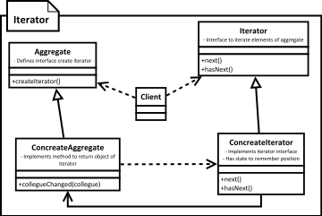

[<back](../DesignPattern.md)

# Iterator
* When we want to iterate or give sequential access to elements of aggregate object we can use iterator design pattern.
* Iterator needs access to internal data structure of aggregator to provide its functionality. This usually means it's quite common to have iterator implemented as inner class.
* Iterator allows the client code to check whether there is an element available to consume the give next available element.
* Normally provide sequential looping but We can also provide reverse, or bi-directional (forward+backward) iterator depending on underlying data structure.

* Iterator allows a way to access elements/children of an aggregate object in sequence while hiding the actual internal data structure used.
* In Java language iterators are integral part of collection frameworks and they are implementations of this design pattern.
* Iterators are stateful, meaning an iterator object remembers its position while iterating.
* Iterators can become out of sync if the underlying collection is changed while a code is using iterator.

## Implement Iterator
* We start by defining Iterator interface
	* Iterator has methods to check whether there is an element availbale in sequence & to get that element
* We then implement the Iterator in a class. This is typically an inner class in our concrete aggregate. Making it an inner class makes it easy to access internal data structures.
* Concrete iterator needs to maintain state to tell its position in collection of aggregate. If the inner collection changes it can throw an exception to indicate invalid state.

## Implementation Considerations
* Detecting change to underlying data structure while some code is using an iterator is important to notify to the client because then our iterator may not work correctly.
* Having out iterator implementation as inner class makes it easy to access internal collection of aggregate objects.

## Design Considerations
* Always prefer iterator interface so you can change the implementation without affecting client.
* Iterators have many applications where a collection is not directly used but we still want to give a sequential access to information for example may be for reading lines from file, from network.

## Examples
* The iterator classes in Java collection framework are great example of iterator. The concrete iterators are typically inner classes in each collection class implementing java.util.Iterator interface.
* The java.util.Scanner class is also an example of Iterator pattern. This class supports InputStream as well and allows to iterate over a stream.
* The javax.xml.stream.XMLEventReader class is also an iterator. This class turns the XML into a stream of event objects.

## Pitfalls
* Access to index during iteration is not readily available like we have in a for loop.
* Making modifications to the collection while someone is using an iterator often makes that iterator instance invalid as its state may not be valid.

