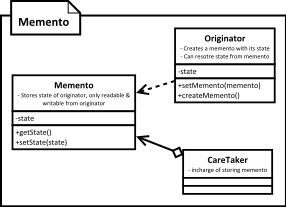

[<back](../DesignPattern.md)

# Memento
* We can use memento design pattern to take a snapshot of object's state which can be then used to restore object to that particular state.
* Memento itself is created such that it doesn't expose any statte stored in it to any other class aside from the originator.
* Originator provides a method to get a memento out of it. And another method to assign it a memento, which results in getting the originator's state reset to the one in memento.
* Mementos need to be saved for them to be of any use. Originator can save them but it adds complexity.
* Memento works well with command pattern. Each commands saves a memento as part of execution.

* When we want to store object's state without exposing internal details about the state then we can use memento design pattern.
* The main intent behind saving state is often because we want to restore the object to a saved state.
* Using memento we can ask an object to give its state as a single, "sealed" object & store it for later use. This object should not expose the state for modification.
* This pattern often combined with Command design pattern to provide undo functionality in application.

## Implement Memento
* We start by finding originator state which is to be "stored" in memento.
* We then implement the memento with requirement that it can't be changed & read outside the originator.
* Originator provides a method to get its current snapshot out, which will return an instance of memento.
* Another method in originator takes a memento object as argument and the originator object resets itself to match with the state stored in memento.

## Implementation Considerations
* It is important to keep an eye on the size of state stored in memento. A solution for discarding older state may be needed to handle large memory consumption scenarios.
* Memento often ends up being an inner class due to the requirement that it must encapsulate All details of what is stored in its instance.
* Resetting to previous state should consider effects on states of other objects/services.

## Design Considerations
* If there is a definite, fixed way in which mementos are created then we can only store incremental state in mementos. This is especially true if we are using command design pattern where every command stores a memento before execution.
* Mementos can be stored internally by originator as well but this complicates the originator. An external caretaker with fully encapsulated Memento provides you with more flexibility in implementation.

## Example
* One great example of memento is the undo support provided by the javax.swing.text.JTextComponent and its child classes like JTextField, JTextArea etc.
* The javax.swing.undo.UndoManager acts as the caretaker & implementations of javax.swing.undo.UndoableEdit interface work as mementos. The javax.swing.text.Document implementation which is model for text components is swing is the originator.
* The java.io.Serializable is often given as an example of Memento but it is NOT a memento & not even a design pattern. Memento object itself can be serialized but it is NOT mandatory requirement of the pattern. In fact memento work most of the times with in-memory snapshots of state.

## Memento vs Command
* In memento, the state of memento is sealed for everyone except originator. Although commands are typically immutable their state is often readable.
* A memento needs to be stored for it to be of any use. Commands can be stored as well but not storing them after execution is optional.

## Pitfalls
* In practice creating a snapshot of state may not be easy if other objects are part of originator's state.
* Resetting a state may not be as simple as copying references. If state change of originator is tied with other parts of application then those parts may become out of sync/invalid due to resetting state.

