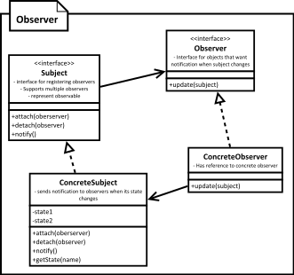

[<back](../DesignPattern.md)

# Observer
* Observer pattern allows to define one-to-many dependency between objects where many objects are interested in state change of a object.
* Observers register themselves with the subject which then notifies all registered observers if any state change occurs.
* In the notification sent to observers it is common to only send reference of subject instead of state values. Observers will call the subject back for more information if needed.
* We can also register observers for a specific event only, resulting in improved performance of sending notifications in the subject.
* This design pattern is also known as publisher-subscriber pattern. Java messaging uses this pattern but instead of registering with subject, listeners register with a JMS broker(Java Message Service broker: that receives messages from producers and sends messages to consumers), which acts as a middle-man.

* Using observer design pattern we can notify multiple objects whenever an object changes state.
* This design pattern is also called as publisher-subscriber or pub-sub.
* We are defining one-to-many dependency between objects, where many objects are listening for state change of a single object, without tightly coupling all of them together.
* This pattern is often implemented where listener only gets notification that "something" has changed in the object's state. Listeners query back to find out more information if needed. This makes it more generic as different listeners may be interested in different states.

## Implement
* We define an interface for observer. Observer is usually a very simple interface and defines a method used by "subject" to notify about state change.
* Subject can be an interface if we are expecting our observers to listen to multiple objects or else subject can be any concrete class.
* Implementing subject means taking care of handling attach, detach of observers, notifying all registered observers & providing methods to provide state information requested by observers.
* Concreate observers use a reference passed to them to class "subject" for getting more information about the state. If we are passing changed state in notify method then this is not required.

## Implementation Consideration
* In some rare scenarios you may end with a circular update loop. i.e. - an update to observable's state result in notification being sent to a observer which then takes some action and that action results in state change of our observable, triggering another notification and so on.
* An observer object can listen for changes in multiple subjects. It becomes quite easy to identify originator for the notification if subjects pass a reference to themselves in notification to observer.
* Performance can become an issue if number of observers are higher and if one or many of them need noticeable time to process notification. This can also cause pile up of pending notifications or missed notifications.

## Design Consideration
* To reduce number of notifications sent on each state update, we can also have observers register for a specific property or event. This improves performance as on an event, subject notifies only the interested observers instead of all registered observers.
* Typically notifications are sent by observable when someone changes its state, but we can also make the client code, which is changing subject's state, send notifications too. This way we get notification when all state changes are done. However client code get this additional responsibility which they may forget to carry out.

## Examples
* Observer is such a useful pattern that Java comes with support for this support in Java Class Library! We have java.util.Observer interface & java.util.Observable class shipped with JDK.
* Another commonly used example is various listeners in Java Servlet application. We can create various listeners by implementing interfaces like HttpSessionListener, ServletRequestListener.
* We then register these listeners with servletContext's addListener method. These listeners are notified when certain events occur like, creation of a request or addition of a value to the session.
* The notification will sent to observers based on the event that has taken place and the interface(s) implemented by registered observers.
* Spring also supports Observer through the org.springframework.context.ApplicationListener interface.

## Observer vs Mediator
* Observer provides with one-to-many relationship between objects. Mediators have many objects communicating with many other objects.
* In Observer, the communication is simple & can be described as a publish-subscribe. In Mediator, the communication is not simple. All objects participating are notified of change in any one of them.

## Disadvantages
* Every setter method triggering updates may be too much if we have client setting properties one after another on our observable.
* Also each update becomes expensive as number of observers increase and we have one or more "slow" observers in the list.
* If observers call back the subject to find what changed then this can add up to quite a bit of overhead.

