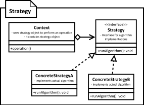

[<back](../DesignPattern.md)

# Strategy
* Strategy pattern allows us to encapsulate algorithms in separate classes. The class using these algorithms (called context) can now be configured with desired implementation of an algorithm.
* It is typically the responsibility of client code which is using our context object to configure it.
* Strategy objects are given all data they need by the context object. We can pass data either in form of arguments or pass on context object itself.
* Strategy objects typically end up being stateless making them great candidates for flyweight pattern.
* Client code ends up knowing about all implementations of strategy since it has to create their objects.

* Strategy pattern allows us to encapsulate an algorithm in a class. So now we can configure our context or main object with an object of this class, to change the algorithm used to perform given operation.
* This is really helpful if you have many possible variations of an algorithm.
* A good indication for applicability of strategy pattern is if we find different algorithms/behaviors in our methods which are selected with conditional statements like if-else or switch-case.
* Strategy classes are usually implemented in an inheritance hierarchy so that we can choose any one implementation and it'll work with our main object/context as the interface is same for all implementations.

## Implement
* We start by defining strategy interface which is used by our main/context class. Context class provides strategy with all the data that it needs.
* We provide implementations for various algorithms by implementing strategy interface a class per algorithm.
* Our context class provides a way to configure it with one of the strategy implementations. Client code will create context with one of the strategy object.

## Implementation Considerations
* We can implement our context in a way where strategy object is optional. This makes context usable for client codes who do not want to deal with concrete strategy objects.
* Strategy objects should be given all data they need as arguments to its method. If number of arguments are high then we can pass strategy an interface reference which it queries for data. Context object can implement this interface and pass itself to strategy.
* Strategy typically end up being stateless objects making them perfect candidates for sharing between context objects.

## Design Considerations
* Strategy implementations can make use of inheritance to factor out common parts of algorithms in base classes making child implementations simpler.
* Since strategy objects often end up with no state of their own, we can use flyweight pattern to share them between multiple context objects.

## Strategy vs State
* In Strategy design pattern, we create a class per algorithm. In state pattern we have a class per state.
* Strategy objects do not need to know about each other. If states are responsible for triggering state transitions then they have to know about at least next state.

## Disadvantages
* Since client code configures context object with appropriate strategy object, clients know about all implementations of strategy. Introducing new algorithm means changing client code as well.

