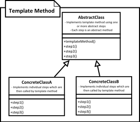

[<back](../DesignPattern.md)

# Template Method
* Template method allow us to define a skeleton of an algorithm in base class. Steps of algorithm are defined as abstract methods in base class.
* Subclasses of our abstract class will provide implementation of steps. This way we can have different implementations for same algorithm.
* Client will create object of any of the concrete subclasses and use the algorithm.
* Factory method design pattern is often implemented as part of template method design pattern.
* One drawback of template method is algorithm implementation is now spread across multiple classes so it makes it slightly difficult to understand.

* Using template method design pattern we define an algorithm in a method as a series of steps (method calls) and provide a chance for subclasses to define or redefine some of these steps.
* The pattern works by defining abstract methods which then have to be implemented by concrete subclasses. These methods are like hooks which are then called by template method.
* This pattern allows you to defer implementation of parts of your algorithm which can vary or change.
* Template methods are an example of inversion of control principle - Don't call us, we'll call you! And this is of course referring to the way template method calls other methods implemented in subclass. SpringFramework also use inversion of control but for dependency injection.

## Implement
* We start by defining our algorithm in template method. We try to break algorithm in multiple steps where each step will become an abstract method.
* While breaking down algorithm the number of steps should not be too many or it can become quite tedious to implement all of them in subclasses.
* Next we implement the abstract steps in one or more subclasses.

## Implementation Considerations
* A balance must be kept in how much granular we want to keep our steps. Too many steps means too many methods to override for subclass where each one may be just a primitive operation. Too few steps on the other hand would mean subclasses end up defining the major parts of algorithm.
* If needed the template method can be made final to prevent subclasses from changing base algorithm.

## Design Considerations
* We can use inheritance within subclasses to reuse parts from already implemented steps. This approach allows subclasses to only change steps they need.
* Factory method design pattern uses template method. Actual factory method is often called as part of another template method.

## Example
* The java.util.AbstractMap, java.util.AbstractSet classes have many non-abstract methods that are good examples of template method pattern.

## Template Method vs Strategy
* In Template Method, all subclasses implement the steps for the exact same algorithm. In strategy design pattern each subclasses represents a separate algorithm.
* In template method client code relies solely on inheritance to get a variation of same algorithm. In Strategy client code use composition principal to configure main class with chosen strategy object.

## Disadvantages
* Tracking down what code executed as part of our algorithm requires looking up multiple classes. The problem becomes more apparent if subclasses themselves start using inheritance themselves to reuse only some of the existing steps & customize a few.
* Unit testing can become a little more difficult as the individual steps may require some specific state values to be present.

