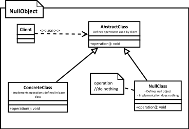

[<back](../DesignPattern.md)

# Null Object
* Null object pattern allows us to represent absence of real object as a do nothing object.
* Method implementations in a Null object will not do anything. In case a return value is expected, these methods will return a sensible, hard-coded default value.
* Classes which use Null object won't be aware of presence of this special implementation. Whole purpose of the pattern is to avoid null checks in other classes.
* Null objects do not transform into real objects, nor do they use indirection to real objects.

* We use "null" value to represent an absence of object. Using "Null Object" pattern we can provide an alternate representation to indicate an absence of object.
* Most important characteristic of a null object is that it'll basically do nothing & store nothing when an operation is called on it.
* Null object seems like a proxy as it stands in for a real object, however a proxy at some point will use real object or transform to a real object & even in absence of the real object proxy will provide some behaviour with side effect. Null object will not do any such thing. Null objects don't transform into real objects.
* We use this pattern when we want to treat absence of a collaborator transparently without null checks.

## Implement step
* We create a new class that represents our null object by extending from base class or implementing given interface.
* In the null object implementation, for each method we'll not do anything. However doing nothing can mean different things in different implementations. e.g. if a method is a null object returns something then we can either return another null object, a predefined default value or null.
* Code which creates objects of our implementation will create & pass our null object in a specific situation.

## Implementation Considerations
* Class which is using Null Object should not have to do anything special when working with this object.
* What "do nothing" means for an operation can be different in different classes. This is especially true where methods in null objects are expected to return values.
* If you find a need where your null object has to transform into a real object then you better use something like state pattern with a null object as one of the states.

## Design Considerations
* Since null objects don't have a state & no complex behavior they are good candidates for singleton pattern. We can use a single instance of null object everywhere.
* Null objects are useful in many other design patterns like state - to represent a null state, in strategy pattern to provide a strategy where no action is taken on input.

## Examples
* The various adapter classes from java.awt.event package can be thought of as examples null object. Only reason they are not the examples of this pattern is that they are abstract classes but without any abstract method.

## Null Object vs Proxy
* Null objects never transform/create or provide an indirection to real object. Many types of proxies will need a real object eventually.
* Null objects do not "act on behalf" of real object. Its job is to do nothing. In absence of real object, proxies will provide behavior matching to real object.

## Pitfalls
* Creating a proper Null object may not be possible for all classes. Some classes may be expected to cause a change, and absence of that change may cause other class operations to fail.
* Finding what "do nothing" means may not be easy or possible. If our null object method is expected to return another object then this problem is more apparent.